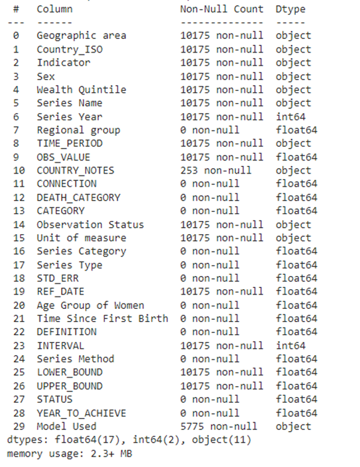
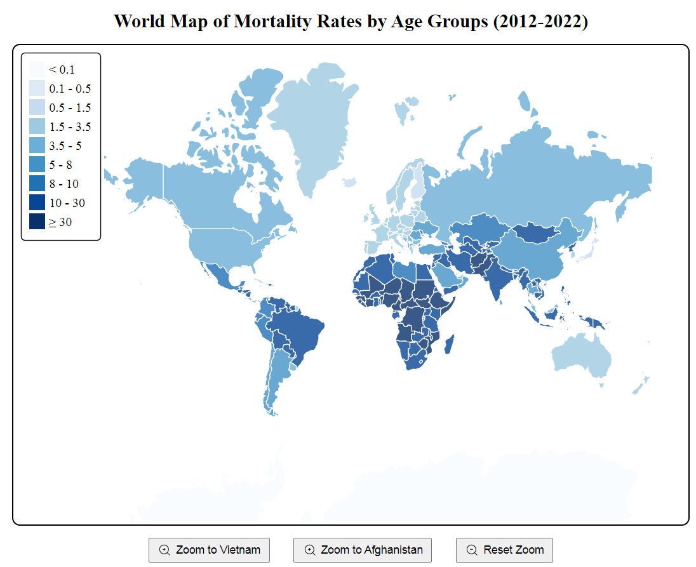
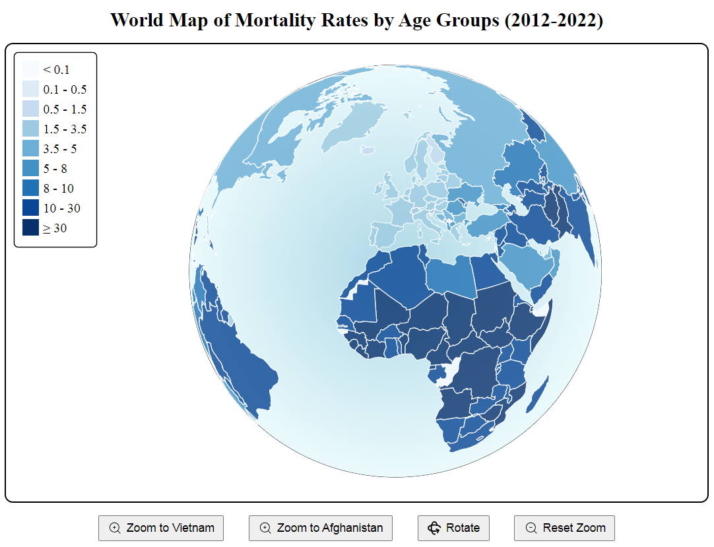
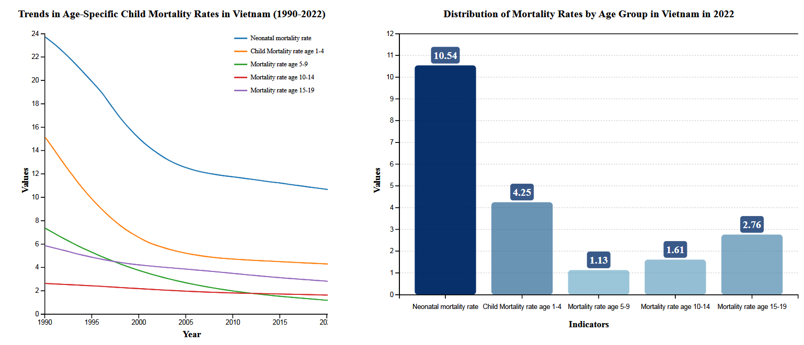
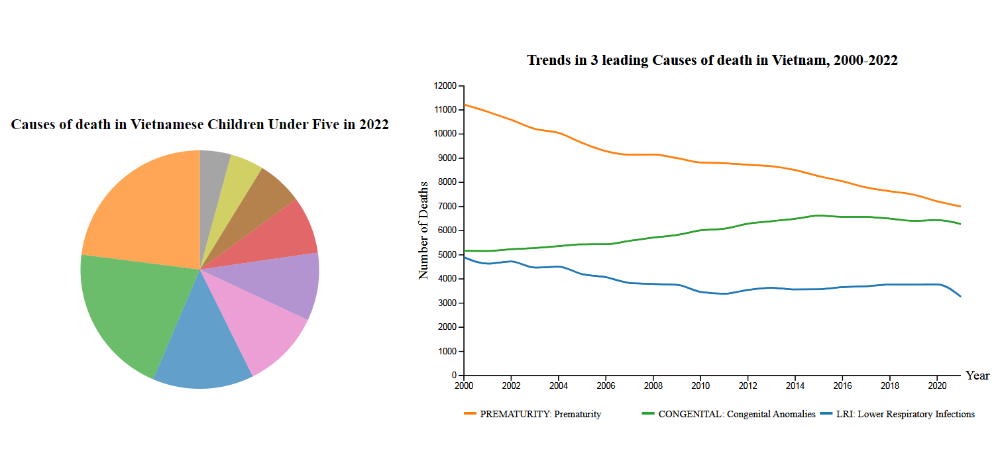
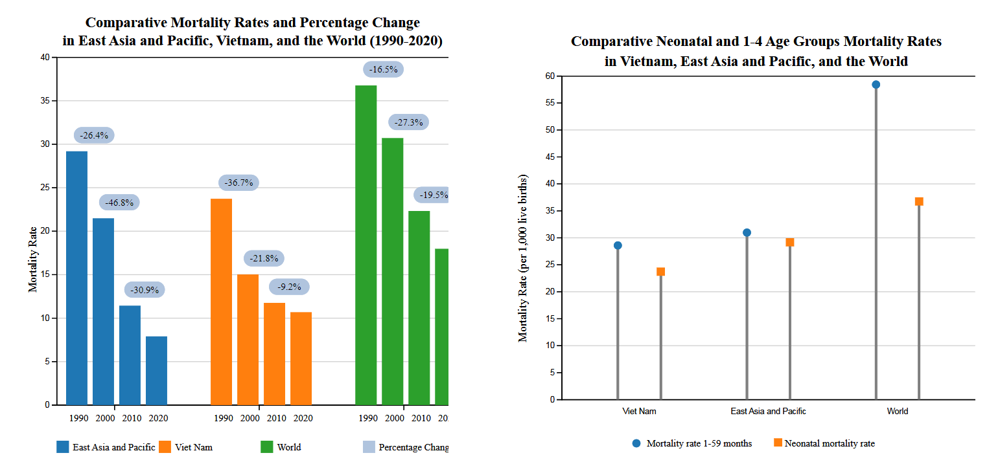
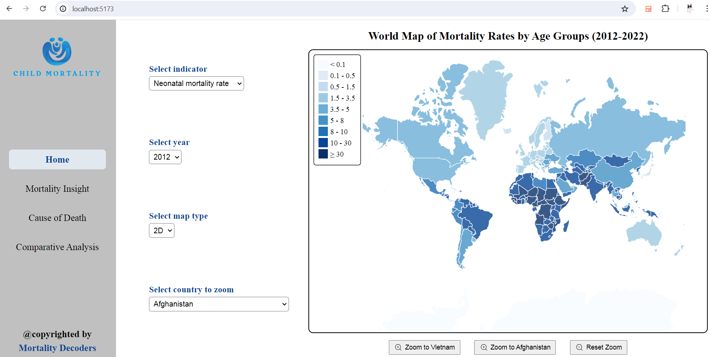

<div id="top" align="center">
</div>
<!-- PROJECT LOGO -->
<div align="center">
<h1 align="center">Data Science & Data Visualization Project</h1>
  <h3 align="center">
    Applying visualization and web design techniques to find insights of data
    <br />
    <br />
    <a href="https://github.com/meiskiet/DSDV_/issues">Report Bug</a>
    ·
    <a href="https://github.com/meiskiet/DSDV_/issues">Request Feature</a>
  </h3>

[![Contributors][contributors-shield]][contributors-url]
[![Forks][forks-shield]][forks-url]
[![Issues][issues-shield]][issues-url]

</div>

# ABOUT

## 1. The team behind it

| No. |       Full Name        | Student's ID |              Email               |                  Github account                   |                               Roles                                | Contribution |
| :-: | :--------------------: | :----------: | :------------------------------: | :-----------------------------------------------: | :----------------------------------------------------------------: | :----------: |
|  1  |  Hoang Tuan Kiet   | ITDSIU21055  | ITDSIU21055@student.hcmiu.edu.vn |     [meiskiet](https://github.com/meiskiet)     |   **TEAM LEADER** with Data Processing and Storytelling, Video Designer   |     20%      |
|  2  |   Nguyen Hai Ngoc    | ITDSIU21057  | ITDSIU21057@student.hcmiu.edu.vn |    [haingocnguyen](https://github.com/haingocnguyen)    |              Data Processing and Storytelling, Report Constructing              |     20%      |
|  3  | Phan Quoc Anh | ITDSIU21001  | ITDSIU21001@student.hcmiu.edu.vn |     [quocanhphan](https://github.com/quocanhphan)     | Data Processing and Storytelling, Script Constructing|     20%      |
|  4  |    Nguyen Luan Cong Bang     | ITITIU20163  | ITITIU20163@student.hcmiu.edu.vn |      [congbangitiu](https://github.com/congbangitiu)      |          Web Designing and Data Visualization           |     20%      |
|  5  |    Pham Minh Vu     | ITITIU20354  | ITITIU20354@student.hcmiu.edu.vn | [PMinhVu](https://github.com/PMinhVu) | Web Designing and Data Visualization |     20%      |

## 2. The project we are working on

By transforming complex data into actionable insights through web-based visualization, our project aims to shed light on the intricate issue of child mortality. We believe that a comprehensive understanding of the multifaceted causes and conditions contributing to child mortality is crucial for developing effective interventions and policies. Through informed advocacy and collaborative efforts, we aspire to make a significant impact in reducing child mortality and improving the health and well-being of children worldwide.

## 3. Goal

•	Using geographic information systems (GIS) to create interactive maps that visualize child mortality rates across different regions and over time.

•	Developing dashboards that allow users to filter data based on specific criteria, such as age, gender, cause of death, and socio-economic conditions.

•	Conducting trend analysis to track changes in child mortality rates and identify emerging hotspots or declining trends.

•	Presenting in-depth case studies of countries or regions that have successfully reduced child mortality, analyzing the strategies and policies implemented.

•	Performing comparative analysis to identify best practices and lessons learned from different contexts.


# REASON

## 1. Motivation

Child mortality remains a persistent and pervasive challenge across the globe, spanning across different time periods and affecting millions of young lives. The causes of child mortality are multifaceted and complex, encompassing a range of factors such as diseases, natural disasters, human-induced events, socio-economic conditions, and more. Our project seeks to delve into these complexities and provide a comprehensive understanding through the power of web-based visualization.

## 2. Idea

We use web-based visualization to turn complex child mortality data into actionable insights for interventions and policies. Interactive maps and dashboards show mortality rates by region and time, aiding our understanding of causes. Through analyzing case studies and data comparisons, we identify best practices to reduce global child mortality. 

## 3. Techniques

• Library: D3.js

• IDE: Visual Studio Code 

• Group work management: GitHub and Microsoft Teams

• Doccument sharing technique: Google Drive

• Programming language for data processing: Python

• Framework: React JS

# DATA PULLING PROCEDURES

## 1. Data Collection Method

Our project sources its primary data from the UN Inter-agency Group for Child Mortality Estimation (IGME), which provides estimated data on stillbirths, all-cause mortality, and specific causes of death for each country globally. 
For our analysis, we focused on the global data and specific causes of death to enrich our storytelling and visualization.


## 2. Data structure

Our data is structured into four distinct parts, each tailored to specific aspects of child mortality:

**Part 1: Global Mortality Data**

**Data Sources:** We compiled five main datasets representing different age-related mortality indicators—Neonatal, and Mortality for ages 5-9, 10-14, 15-19, and 20-24.

**Data Processing:** These datasets were merged into a single file named 'Mortality for All,' enhancing our analysis capability.

**Key Features:** Includes geographic area, ISO country codes, specific mortality indicators, time periods of data collection from June 2012 to June 2022, observed mortality rates, and their respective bounds.

**Part 2: National Data (Vietnam)**

**Scope:** Similar format to Part 1 but specifically focuses on Vietnam over a 33-year period.

**Key Features:** Covers the same age groups with additional local context, providing a long-term perspective on trends within the country.

**Part 3: Cause of Death in Vietnam**

**Dataset Composition:** Two datasets visualizing the proportion and number of death cases by cause.

**Visualization Focus:** The first dataset displays the proportion of each death cause for the year 2021, while the second tracks the number of deaths from the three most prevalent causes from 2000 to 2021.

**Part 4: Comparative Mortality Rates**

**Data Composition:** Focuses on Neonatal Mortality and Mortality rates for 1-59 months, comparing Vietnam, East Asia and Pacific, and global data.

**Period Coverage:** From June 1990 to June 2022, providing a comprehensive view of trends over time.


## 3. EDA

Datasets of 4 parts mostly contain non-null values. While there are still some null value records, all of them are presented in the worthless attributes, which can be ignored. The figure below is an typical example for the general case:



# STORY-TELLING

## 1. World Map



This world map provides a comprehensive view of child mortality rates from 2012 to 2022. Each country is shaded according to its mortality rate, with darker colors indicating higher rates and lighter colors indicating lower rates.

Next, we have a 3D map showing child mortality rates across five age groups. The 3D view allows for interactive exploration, providing detailed information when hovering over each country.
These world maps help us quickly understand the distribution and severity of child mortality across the globe.




## 2. Mortality Insights



This part presents a detailed view of age-specific child mortality trends in Vietnam from 1990 to 2022. This graph provides a snapshot of the current state of mortality in Vietnam, highlighting which age groups are most affected over this period.
As we can see, the mortality rates for neonatal and younger age groups have seen significant declines over the past three decades. This visualization allows us to observe how healthcare improvements have impacted different age groups, particularly the youngest children.

Then, we choose the latest year, 2022 to plot the bar graph in order to observe the distribution of mortality rates for all five age groups. By examining this data, we can see that the neonatal and age 1-4 mortality rates remains the highest among the age groups, indicating an area that still requires focused healthcare efforts.

Let’s group the neonatal and age 1-4 mortality rates into under 5 age groups to explore the reason behind the high mortality rates.


## 3. Cause of Death



This provides an overview of the causes of death for children under five in Vietnam in 2022. The pie chart shows that prematurity (23%) and congenital anomalies (20.6%) are the leading causes, followed by lower respiratory infections and asphyxia. This helps us identify key health issues to address.

The line graph tracks the three leading causes of death over time. It shows a gradual decline in deaths due to prematurity, congenital anomalies, and lower respiratory infections, indicating progress. Understanding these trends is crucial for future healthcare interventions.

## 4. Comparative Analysis



The last part presents a comparative analysis of child mortality rates across different regions and time periods. On the left, the bar graph compares mortality rates in 1990, 2000, 2010, and 2020 for East Asia and Pacific, Vietnam, and the world. The percentage change is indicated by small boxes above each bar.

Vietnam and the East Asia and Pacific region have seen significant declines in mortality rates, suggesting effective public health improvements. Contributing factors may include economic growth, government policies, and social factors, showcasing successful collaboration in these regions.

Next, the dot graph compares neonatal and under-five mortality rates across Vietnam, East Asia and Pacific, and the world. Neonatal mortality rates are higher across all regions, but Vietnam shows lower rates, reflecting effective healthcare interventions. Despite this, challenges remain due to issues like prematurity and congenital anomalies, highlighting the need for ongoing targeted efforts.

# PROJECT STRUCTURE

- `assets`:  contains static assets used in the project, such as images, fonts, or icons.

  - `data`: This folder might contain data files used by the application.

  - `images` folder: This folder likely stores images used in the project.

- `components` folder: This folder likely contains React components that make up the building blocks of the user interface.

  - `sidebar` folder: This folder likely contains components for the sidebar UI.

    - `index.jsx` - This file likely contains the JSX code for the sidebar component.

    - `index.module.scss` - This file likely contains the CSS modules for styling the sidebar component.

  - `svgs` folder - This folder likely contains SVG icons used in the project.

    - `cause-of-death` folder: This folder likely contains components related to cause of death data visualization.

      - `LineChart.jsx` - This file likely contains the JSX code for a line chart component.

    - `home` - Contains components related to the home page of the application.
    - `mortality-insight` - Contains components related to mortality insights.
    - `progress` - Contains components related to the progress section of the application.
  - `layout` - Contains the layout components that define the overall structure of the application.
    - `Layout.jsx` - Contains the JSX code for the main layout component.
  - `pages` - Contains the different pages of the application.
    - `cause-of-death` - Contains components specific to the cause of death page.
      - `index.jsx` - Contains the JSX code for the cause of death page.
      - `index.module.scss` - Contains the CSS modules for styling the cause of death page.
  - `routers` - Contains the routing logic for the application, which specifies how the application navigates between different pages.
    - `Routers.jsx` - Contains the JSX code for the routing component.
- `App.css` - Contains global CSS styles for the application.
- `App.jsx` - Contains the main component of the React application.
- `GlobalStyle.css` - Contains global CSS styles for the application.
- `main.jsx` - Might be the entry point of the React application.
- `.eslintrc.cjs` - Contains ESLint configuration for code linting.
- `.gitignore` - Specifies files and folders that should be ignored by Git version control.
- `.prettierrc` - Contains Prettier configuration for code formatting.
- `index.html` - Is the entry point for the HTML document that serves as the host for the React application.
- `jsconfig.json` - Contains configuration for JavaScript in the project.
- `package-lock.json` - Contains information about the specific versions of dependencies locked for the project.
- `README.md`: a document to outline and explain the project

# INSTALLATION

## Required software

- Java Development Kit 17++ (i.e. OpenJDK) [CLICK TO DOWNLOAD](https://openjdk.org/)
- Any Java IDE (i.e. JetBrains IntelliJ IDEA) [CLICK TO DOWNLOAD](https://www.jetbrains.com/idea/download/)

## Steps

1. Clone the repo
   ```sh
   git clone https://github.com/GiaKhanhs/DM_Project.git
   ```
2. Open in a Java IDE (preferably JetBrains IntelliJ IDEA)
3. Now click on File > Project Structure... > Library. Click on (+) button on point to the `lib` folder, add the
   following libraries:

- `lib/weka.jar` for Weka main library
- `lib/extraTrees.jar` for ExtraTrees library
- `lib/javafx-sdk-osx-arm64/lib` for JavaFX on **Apple Silicon Macs**
  or `lib/javafx-sdk-win64/lib` for JavaFX on **Intel/AMD Windows PC**. For others platform, please refer
  to [here](https://gluonhq.com/products/javafx/) and download `JavaFX v22.0.1` for your platform.


# DEMO - RESULT



<!-- CONTRIBUTING -->

# CONTRIBUTING

Contributions are what make the open source community such an amazing place to learn, inspire, and create. Any
contributions you make are **greatly appreciated**.

If you have a suggestion that would make this better, please fork the repo and create a pull request. You can also
simply open an issue with the tag "enhancement".
Don't forget to give the project a star! Thanks again!

1. Fork the Project
2. Create your Feature Branch (`git checkout -b feature/AmazingFeature`)
3. Commit your Changes (`git commit -m 'Add some AmazingFeature'`)
4. Push to the Branch (`git push origin feature/AmazingFeature`)
5. Open a Pull Request

<!-- CONTACT-->

# CONTACT

Hoang Tuan Kiet by **[Email HERE](mailto:ITDSIU21055@student.hcmiu.edu.vn)**

Project Link: **[GitHub HERE](https://github.com/meiskiet/DSDV_/issues)**

<!-- ACKNOWLEDGMENTS -->

# ACKNOWLEDGEMENTS

We want to express our sincerest thanks to our lecturer and the people who have helped us to achieve this project's
goals:

- []() Dr. Tran Thanh Tung
- []() The README.md template from **[othneildrew](https://github.com/othneildrew/Best-README-Template)**

<!-- MARKDOWN LINKS & IMAGES -->

[contributors-shield]: https://img.shields.io/github/contributors/meiskiet/DSDV_.svg?style=for-the-badge
[contributors-url]: https://github.com/meiskiet/DSDV_/graphs/contributors
[forks-shield]: https://img.shields.io/github/forks/meiskiet/DSDV_.svg?style=for-the-badge
[forks-url]: https://github.com/meiskiet/DSDV_/network/members
[issues-shield]: https://img.shields.io/github/issues/meiskiet/DSDV_.svg?style=for-the-badge
[issues-url]: https://github.com/meiskiet/DSDV_/issues
